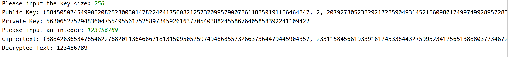
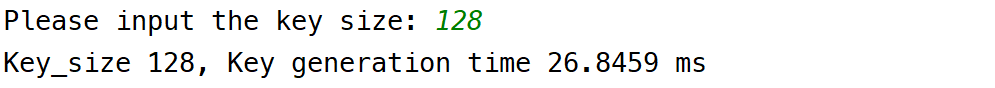

# 数据隐私第一次实验实验报告

> 姓名：王道宇  
>
> 学号：PB21030794

## 文件结构

```bash
src
    │  dp-sgd.py  // dp-sgd 部分
    │  elgamal.py  // 基础加解密 部分
    │  elgamal_big_data.py  // 对于大数据的加解密部分
    │  gen_plaintext.py // 生成大数据
    │  test_property.py //验证elgamal算法的两个性质
```

## dp-sgd 部分

### 代码实现

1. 根据 PPT 中的裁剪思路，将梯度裁剪到 [-C, C] 以内：

   ```python
   def clip_gradients(gradients, C):
       max = np.maximum(1, np.linalg.norm(gradients, ord=2) / C)
       clip_gradients = gradients / max
       return clip_gradients
   ```

   其中 np.linalg.norm 即为求范数的函数， ord 参数代表范数的维数。

2. 在求高斯噪声时，由其公式：
   $$
   \mathcal{M}_{Gauss}(x, f, \epsilon,\delta) = f(x) + \mathcal{N}(\mu = 0, \sigma^2 = \frac{2\ln (1.25/\delta)\cdot(\Delta_2f)^2}{\epsilon^2})
   $$

   - gradients 为一位数组，查询函数即为 test 部分的数据，也就是对每一个个体做查询，所以其全局敏感度 $\Delta_2 f = max(gradients) - min(gradients)$。

   - 根据差分隐私的 advanced composition 特性，在 *self*.num_iterations 轮次的差分隐私查询之后，还需要达到给定的差分隐私参数 $(\epsilon,\delta)$ ，就需要满足以下的方程：
     $$
     \begin{cases}
     \epsilon = \sqrt{2k\ln(1/\delta')}\epsilon' + k\epsilon'(e^{\epsilon' } - 1) \\
     \delta = k\delta' + \delta'
     \end{cases}
     $$
     使用 sympy 库用于求解 $\epsilon', \delta'$，可得求解函数为：
     
     ```py
     import sympy as sp
     from sympy import symbols, Eq, nsolve
     
     def get_param(epsilon, delta, epochs):
         delta_u = delta / (epochs + 1)
         x = symbols('x')
         equation = Eq(sp.sqrt(2 * epochs * sp.log(1 / delta_u)) * x + epochs *                x * (sp.exp(x) - 1), epsilon)
         epsilon_u = nsolve(equation, x, epsilon / epochs)
         return epsilon_u, delta_u
     ```
     
     通过代数求解即可得到所需 epsilon_u 和 delta_u 的值。
   
   最终求高斯噪声的函数为：
   
   ```python
   def add_gaussian_noise_to_gradients(gradients, epsilon, delta, C):
       sigma = np.ptp(gradients) * np.sqrt(2 * np.log(1.25 / delta)) / epsilon
       noise = np.random.normal(loc=0, scale=sigma * C, size=gradients.shape)
       noisy_gradients = noise + gradients
       return noisy_gradients
   ```
   
   其中 np.ptp 为 peak to peak ，用于生成最大值与最小值之差。

### 结果展示

1. 正确性展示

   默认 $(\epsilon, \delta) = (0.1, 1\times10^{-3})$ 的情况下，DP accuracy 是不稳定（不收敛的），其几个典型值如下：

   

   
   
   经过测试，当 $\epsilon = 10000$ 时， DP accuracy 比较稳定，其典型值为：

   

2. 探究部分

   - 相同迭代轮数，不同隐私预算，即保持 $self.num\_iterations = 1000$ 不变

     | **epsilon** | **0.1**    | **1**        | **10**     | **100** | **1000** | **10000** |
     | ----------- | ---------- | ------------ | ---------- | ------- | -------- | --------- |
     | **典型值**  | 0.26，0.47 | 0.505，0.765 | 0.61，0.76 | 0.835   | 0.845    | 0.85      |

     可以看到隐私预算越大，DP accuracy 表现越好。

   - 相同隐私预算，不同迭代轮数，即保持 $\epsilon = 10000$ 不变

     | **num\_iteration**     | **100** | **1000** | **10000** | **100000** |
     | ---------------------- | ------- | -------- | --------- | ---------- |
     | **normal model典型值** | 0.85    | 0.885    | 0.86      | 0.86       |
     | **dp model典型值**     | 0.83    | 0.85     | 0.88      | 0.855      |

     - 当迭代轮数过低时，会出现欠拟合的现象，导致不论是普通模型还是差分隐私模型，其正确性都难以保证。

     - 当迭代轮数过高时，会出现过拟合的现象，导致模型在未见过的数据上表现较差，即使在训练数据上表现很好。并且迭代时间过长，训练时间过长也是不切实际的。

## elegmal 部分

### 加解密功能实现

实现快速幂算法，生成公私钥算法以及基本的加解密算法之后，选取 key-size 为 256，选取传输的整数为 123456789，最终加解密的结果如下：



可以看到算法正确地进行了加解密。其中代码中的快速幂如下：

```python
def mod_exp(base, exponent, modulus):
    base = base % modulus
    result = 1
    while exponent > 0:
        if exponent & 1: # 取该位的数字
            result = result * base % modulus
        base = base * base % modulus
        exponent >>= 1 # 下一位
    return result
```

快速幂算法本质思想是通过将指数进行二进制拆分，利用指数的二进制表示形式来减少乘法运算的次数，从而提高计算效率。利用指数的二进制表示来分解幂运算，将其转化为多个底数的乘积。这样，通过不断平方和相乘，可以在对数级别的时间内完成整数次幂的计算，而不是线性时间。

代码中的加解密过程与 PPT 一致，需要注意的是，$s^{-1}$ 是 $s$ 的模逆元的计算中，有下式存在：
$$
s^{-1} = s^{p-2}
$$
因为 $s^{p-2}\cdot s = s^{p-1} = s^{\Phi(p)} \equiv 1\mod p$ 。

加密：

```python
def elgamal_encrypt(public_key, plaintext):
    p, g, y = public_key
    k = random.randint(1, p - 2)
    c1 = mod_exp(g, k, p)
    c2 = plaintext * mod_exp(y, k, p) % p
    return c1, c2
```

解密：

```python
def elgamal_decrypt(public_key, private_key, ciphertext):
    p, g, y = public_key
    c1, c2 = ciphertext
    s = mod_exp(c1, private_key, p)
    assert s  # s != 0
    plaintext = c2 * mod_exp(s, p - 2, p) % p
    return plaintext
```

### 三个不同的 key-size 下的时间开销

- $key = 64$

  

- $key = 128$

  

- $key = 256$

  

- $key \geq 512$

  压根跑不出来。

### 验证随机性和乘法同态性

为了验证其性质，我们使用同一次生成的公私钥，并多次输入需要加密的整数。

- 为了验证随机性，我们使用了相同的输入，通过两次加密，比较两次加密后的密文是否相同。

- 为了验证乘法同态性，我们使用不同的输入并生成的不同的密文，再对比将两个密文分别解密后的乘积以及乘积之后解密的结果是否相同。

结果：

- 验证随机性

  

- 验证乘法同态性并计时

  
  
  可以看到，**先将密文相乘再进行解密**比**将密文解密再相乘**的时间要**短**，由于密文较长，两个密文的相乘可以看作大整数乘法，考虑到该过程的两个最耗时的子过程：大整数乘法和解密，可以得出解释：该过程的**瓶颈出现在解密**而不是大整数乘法。这导致**将密文解密再相乘**可能需要更长的时间。

### 大数据下算法时间开销

为了模拟大数据下的算法时间，我生成了一定范围内的 10000 个随机整数。做如下的几个优化：

1. 预计算与分组

   可以看到加解密时有很多变量可以重复利用，在分组之后每一组共享随机数 k 。

   这样分组之后每组的第一个成员可以在加解密的过程中，将中间变量保存下，供给该组的其他成员对应的加解密过程中使用。

   分组过程为：

   ```python
   batch_size = 10
   plaintexts = [plaintexts[i:i + batch_size] for i in range(0,len(plaintexts), batch_size)]
   ```

   同时，中间变量有加密时的 $g^{k} \mod p$ 和 $y^k \mod p$ 以及解密时的 $s^{-1}$ ，将该中间变量保存之后可得：

   ```python
   def elgamal_batch(plaintexts, public_key, private_key):
       c1, c3, s_1 = 0, 0, 0
       for idx, plaintext in enumerate(plaintexts):
           if idx == 0:
               ciphertext, c3 = encrypt_batch_0(public_key, plaintext)
               c1 = ciphertext[0]
               decrypted_text, s_1 = decrypt_batch_0(public_key, private_key,                                     ciphertext)
           else:
               ciphertext = encrypt_batch(public_key, plaintext, c1, c3)
               decrypted_text = decrypt_batch(public_key, s_1, ciphertext)
           assert decrypted_text == plaintext
   ```

   

2. 加入 python 并行策略

   使用 python 并行方法，引入多进程（multiprocessing）的进程池 Pool，通过多进程的方式并行加密解密，其代码如下：

   ```python
   batch_size = 10
   plaintexts = [plaintexts[i:i + batch_size] for i in range(0,len(plaintexts), batch_size)]
   pool = Pool(processes=5)  # 5进程
   for plaintexts_batch in plaintexts:
       pool.apply_async(elgamal_batch, args=(plaintexts_batch, public_key, private_key))
   pool.close()
   ```

使用三种方法对 10000 条正整数加密解密的过程如下，其中三种方法分别为

- 逐个加解密

- 分组加预计算

- 分组预计算加并行

其分别的时间开销如下：


- 逐个加解密：  5780.7 ms

- 分组加预计算：  583.1 ms

- 分组预计算加并行：  45.9 ms

可以看到，逐个加解密的时间大约是分组加预计算的 10 倍，同时分组预计算又比并行算法慢 10 倍，可见优化是非常有效的。