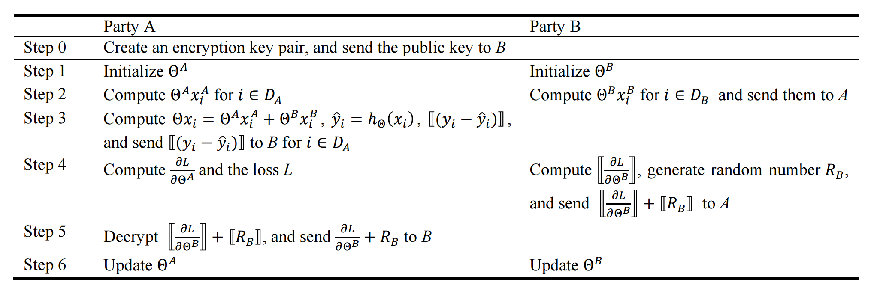
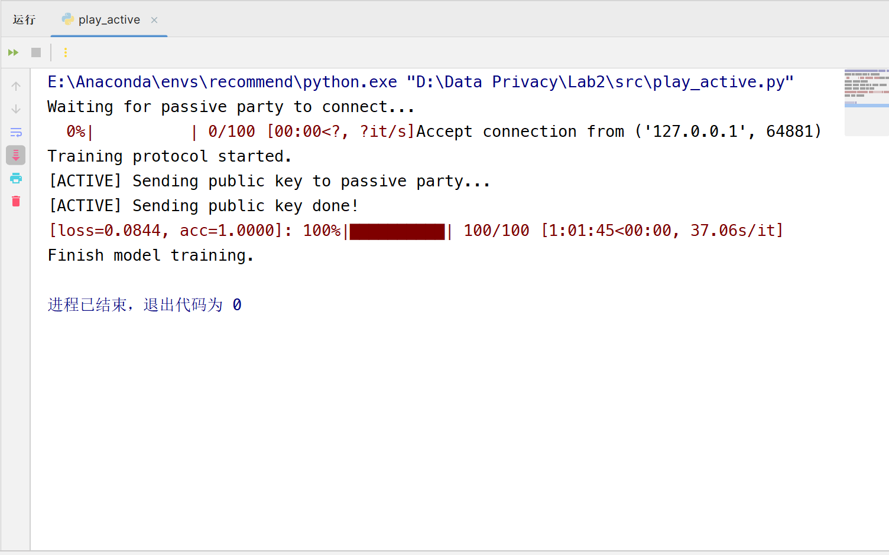
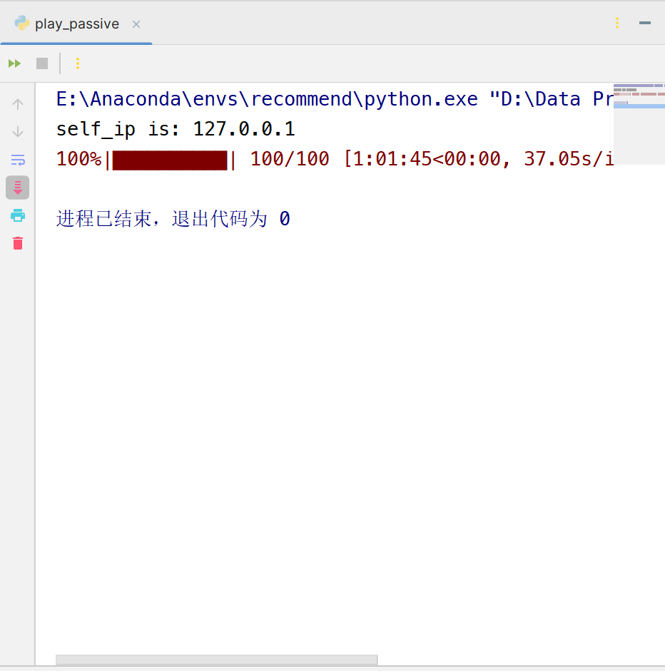

# 数据隐私第二次实验实验报告

> 姓名： 王道宇
>
> 学号：  `PB21030794`

## 目录

[toc]

## `VFL-LR` 算法

### `VFL-LR` 算法原型



### 代码解释

在这里，我们以 `active` 方和 `passive` 方的收（`recv`）发（`send`）信息为时间线解释代码。

1. `active` 方生成训练数据和模型参数之积

   ```python
   active_wx = self.x_train[batch_idxes] @ self.params  # ‘@’ 表示 numpy 的矩阵
   ```

2. `passive` 方生成训练数据和模型参数之积并发送给 `active` 方

   ```python
   passive_wx = self.x_train[batch_idxes] @ self.params
   self.messenger.send(passive_wx)
   ```

3. `active` 方接收，将两者求和再使用 `sigmoid` 函数激活生成预测数据线性预测值

   ```python
   passive_wx = self.messenger.recv()
   full_wx = active_wx + passive_wx  # compute linear predictor
   y_hat = self.activation(full_wx)
   ```

4. `active` 方根据预测数据和训练数据求 `loss` 、 `accuracy` 和残差

5. `active` 方将残差加密并发送给 `passive` 方

   ```python
   enc_residue = self.cryptosystem.encrypt_vector(residue)  # 使用 paillier 加密残差
   enc_residue = np.array(enc_residue)
   self.messenger.send(enc_residue)
   ```

6. `passive` 方接收加密后的残差并求梯度下降并加密结果

7. `passive` 方生成噪声并加密，将噪声保存

   ```python
    enc_mask_grad, mask = self._mask_grad(enc_grad)
   ```

   ```python
    def _mask_grad(self, enc_grad):
        mask = np.random.rand(enc_grad.shape[0])  # 随机生成 [0, 1) 内的随机数，这里随机数只                                                是做增加未知数个数使用，所以什么形式并不重要
        enc_mask = self.cryptosystem.encrypt_vector(mask)  # 加密 mask
        enc_mask_grad = enc_grad + enc_mask  # 加密梯度 + 加密 mask
        return enc_mask_grad, mask
   ```

8. `passive` 方将加密结果和加密噪声相加并发送给 `active` 方

9. `active` 方接收并解密，将解密结果发送给 `passive` 方

   ```python
   enc_passive_grad = self.messenger.recv()
   passive_grad = self.cryptosystem.decrypt_vector(enc_passive_grad)  # 使用 paillier 解                                                                      密梯度
   self.messenger.send(passive_grad)
   ```

10. `passive` 方接收，将解密结果减去之前保存的噪声，此时应用了 `paillier` 加密法的同态加法性质，即 $[u + v] = [u] + [v]$

    ```python
    true_grad = self._unmask_grad(mask_grad, mask)
    ```

    ```python
     def _unmask_grad(self, mask_grad, mask):
         true_grad = mask_grad - mask
         return true_grad
    ```

11. `active` 方和 `passive` 方更新模型参数

## 实验结果

运行 play_active 和 play_passive ，建立连接之后，经过 100 轮的迭代，最终实验结果为：

- active 方

  

- passive 方

  

## `scale` 函数的原理和作用

### `scale` 函数原型

```python
def scale(dataset):
    raw_dataset = dataset.get_dataset()

    start_col = 2 if dataset.has_label else 1
    scaled_feats = preprocessing.scale(raw_dataset[:, start_col:], copy=False)
    raw_dataset[:, start_col:] = scaled_feats

    dataset.set_dataset(raw_dataset)
```

- play_active 调用

```python
trainset = Dataset.from_csv(has_label=True, abs_path=abs_path)
scale(trainset)
```

- play_passive 调用

```python
trainset = Dataset.from_csv(has_label=False, abs_path=abs_path)
scale(trainset)
```

### `scale` 函数的原理

1. 第 2 行得到 `trainset` 的原始数据，也就是 `ndarray` 型的数据

2. 第 4 行对两种不同数据集（是否有标签）做了区分，其中有标签的数据，其特征（feature）从下标 2 开始，无标签的数据，特征从下标 1 开始

3. 第 5 行调用 `preprocessing` 的 `scale` 函数，省略了 3 个默认参数： **axis=0**、**with_mean=True**、**with_std=True**，该函数用于对原数据进行标准化。

   - **axis=0** 表示按列进行标准化，也就是对每一个特征进行标准化，而不是对每一个样本
   - **with_mean=True** 表示进行均值标准化，即减去均值
   - **with_std=True** 表示进行标准差标准化，即除以标准差
   - **copy=False** 表示禁止拷贝，在原址修改

   所以 scale 函数的意义对原数据进行了下列的变换，其中 $Y$ 是每一列数据，$\mu$ 是该列数据的均值，$\sigma$ 是该列数据的标准差。
   $$
   Y\sim\frac{Y-\mu}{\sigma}
   $$

4. 第 6 行的赋值实际没有实际意义，因为上文已经限制了拷贝，要求在原址修改，所以不需要重新赋值给原数据。在这里只是为了看的清楚。

5. 第 8 行将处理过后的 `ndarray` 型的原始数据重新转换为 `trainset` 的类型。

### `scale` 函数的作用

1. **加速收敛速度：** 梯度下降算法通过计算损失函数关于参数的梯度来更新模型参数。如果特征具有不同的尺度，梯度的方向可能会因为尺度的影响而不够准确，导致算法收敛速度较慢。标准化特征可以使得梯度的方向更一致，有助于更快地找到最优解，加速收敛速度。
2. **避免梯度爆炸：** 当特征具有不同的尺度时，梯度的值可能会有很大的差异，导致梯度爆炸或梯度消失的问题。标准化特征可以缓解这些问题，使得梯度的范围更稳定，有助于避免数值不稳定性。
3. **更容易选择学习率：** 特征尺度不一致可能导致选择合适学习率变得困难。标准化特征可以使得学习率的选择更加直观，更容易找到一个适中的学习率。

## 使用 `epoch` 作为随机数种子

### 意义

1. **增加随机性：** 在每个 epoch 开始时使用不同的随机数种子，可以引入一定的随机性，使得模型在每个 epoch 中对数据的处理方式不同。避免在固定的随机性下陷入局部最优。
2. **提高泛化性能：** 引入更多的随机性有助于提高模型的泛化性能，使得模型更能适应不同的数据分布。
3. **可重复性：** 每个 epoch 使用不同的随机数种子仍保留了一定的可重复性，因为每个 epoch 的种子仍然是可控制的。这对于实验的可重复性和结果的控制是重要的。
4. **避免过拟合：** 有助于防止模型过度依赖于特定的数据排列，从而减少过拟合的风险。

### 另一种方式实现

为了保证 **随机性** 和 **可重复性** ，我们需要保证：

1. 每个训练轮次种子不同
2. 但是种子尽量可控制

方法一：

可以先生成 `0` 到 `epochs` 的排列，再使用确定的种子进行打乱，通过 `epoch` 得到对应位置的种子，这样打乱的结果是确定的，保证了可重复性，但每个轮次的种子也是不同的。代码如下：

```python
# 创建一个包含0到99的排列的一维数组
original_array = np.arange(100)
# 设置确定的种子
np.random.seed(42)
# 打乱数组
np.random.shuffle(original_array)

# Main Training Loop Here
for epoch in trange(self.epochs):
    all_idxes = np.arange(n_samples)
    np.random.seed(original_array[epoch])
    np.random.shuffle(all_idxes)

```

方法二：

结合多个种子可以通过将多个种子进行组合或拼接的方式来实现。这样的组合可以使用加法、异或，或者哈希函数。

比如使用 epoch 和 label 和 feature 的组合来实现。

## `VFL-LR` 训练流程中潜在的隐私泄露风险

### 隐私泄露风险

在训练的过程中，我们假设 `active` 方和 `passive` 方都是 honest but curious。但如果 `active` 方是恶意的，它可以通过设置除了**某一个**之外的所有的残差为 `0` ，这样，它可以**一个一个地**得到 $x_i^{passive}$ 的值。

### 可能的保护方式

在计算梯度下降时要做边界检查，排查出类似上述的恶意攻击。
