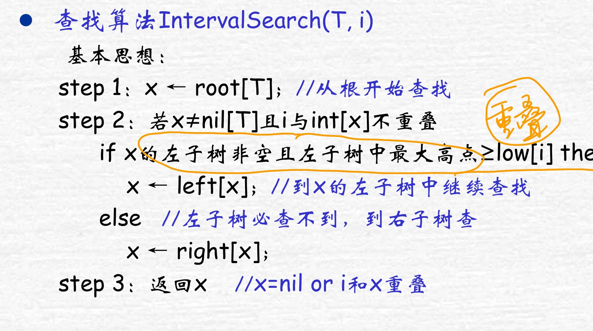
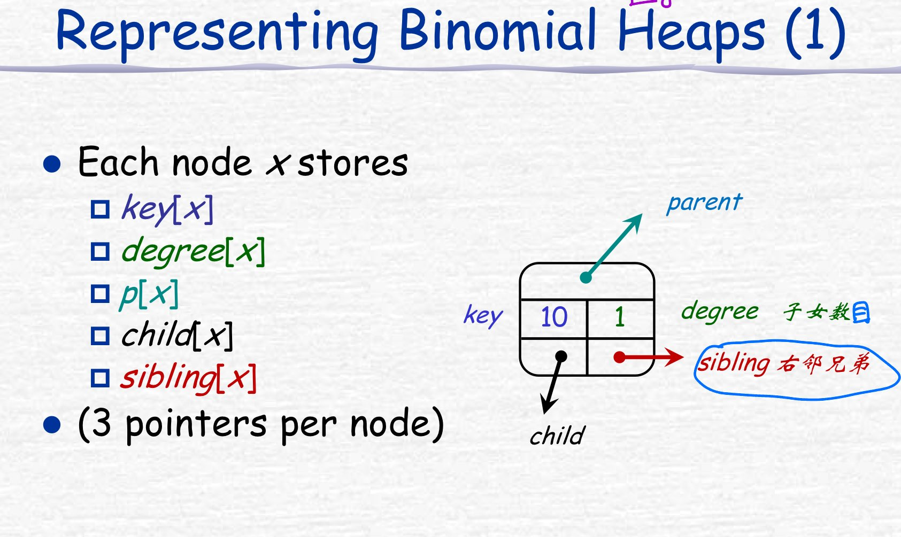
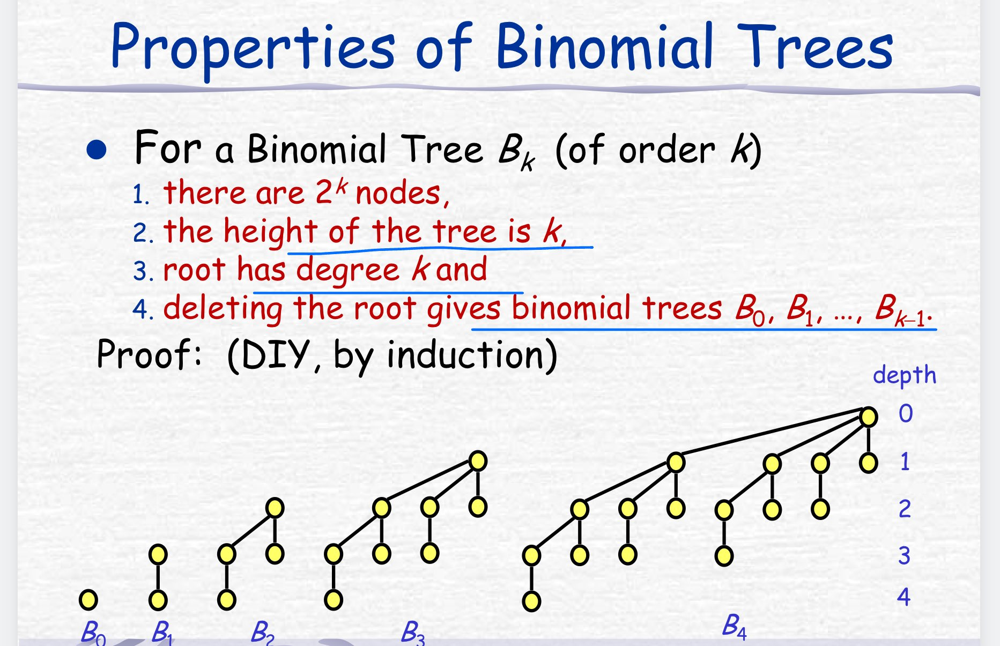
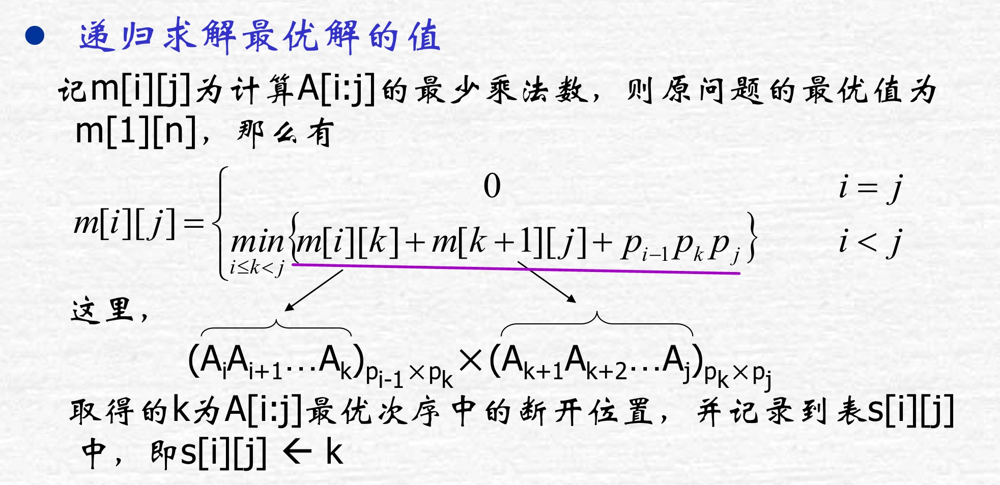
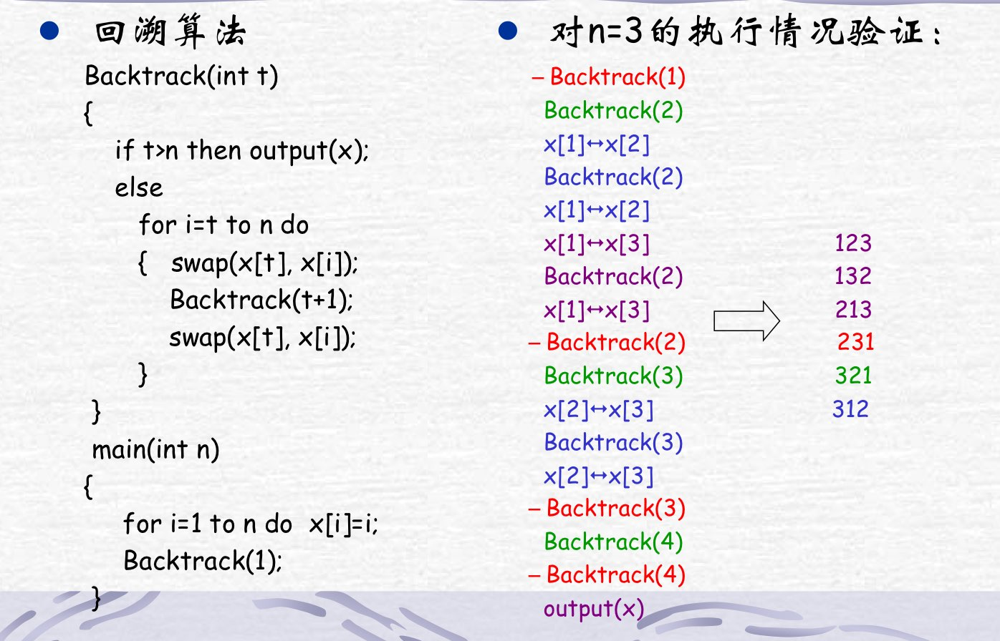

# 算法期末复习

## 函数增长率和复杂度

1. $\Theta(g(n))$

   渐进确界

   

2. $O(g(n))$

   渐进上界

   

3. $\Omega(g(n))$

   渐进下界

   

4. 性质

   

   

   **并不是所有函数之间都可比**，这一点跟整数不一样。比如 $f(n) = n$，$g(n) = n^{1 + \sin x}$，$f(n)$ 和 $g(n)$ 之间无法进行对比。

## 递归关系式和分治法

### 常用函数与求和

1. 取整函数

   - $\forall x \in \mathcal{R} ~~~~x - 1 < \lfloor x \rfloor \leq x \leq  \lceil x \rceil < x + 1 $
   - $\forall n \in \mathcal{Z}~~~~\lfloor\frac{n}{2}\rfloor + \lceil \frac{n}{2} \rceil = n$
   - 

2. 取模函数

   $a \mod n = a - \lfloor \frac{a}{n} \rfloor \cdot n$

3. Stirling 公式

   $n! = \sqrt{2\pi n}(\frac{n}{e})^n(1+\Theta(\frac{1}{n}))$

   $n! = o(n^n)$

   $n! =  \omega(2^n)$

   $\log n! = \Theta(n\log n)$

   

4. 对数迭代

   $\log^*n = \min \{i \geq 0,~\log^{(i)}n \leq 1 \}$

   | $n$      | $2$  | $2^2$ | $2^4$ | $2^{16}$ | $2^{65536}$ |
   | -------- | ---- | ----- | ----- | -------- | ----------- |
   |          | 2    | 4     | 16    | 65536    |             |
   | $\log^*n$ | 1    | 2     | 3     | 4        | 5           |

   可以基本假设所有输入 $n$ 都不会有 $\log^*(n) > 5$。

   >   $\log^*(\log n)$ 和 $\log(\log^*n)$ 谁增长更快？
   >
   >   $\log^* n = \log^* (\log n) + 1$
   >
   >   $\log^*(\log n) > \log(\log^* (\log n) + 1) $
   >
   >   前者更快

5. 斐波拉契通项

   $F_i = \frac{1}{\sqrt{5}}((\frac{\sqrt{5} + 1}{2})^i - (\frac{1-\sqrt{5}}{2})^i)$

6. 标准增长函数

   - 多项式时间阶

     $O(1) < O(\log n) < O(n) < O(n\log n) < O(n^2)$

   - 指数时间阶

     $O(2^n) < O(n!) < O(n^n)$

   - 紧致界

     $\ln n \leq H_n \leq 1 + \ln n$

### 递归式求解

1. 替换法

   > 猜测解 + 替换 + 推导出同样结构的表达式

   经典例子：

   - $T(n) = 2T(\frac{n}{2}) + n$

     $T(n) = O(n\log n)$

   - $T(n) = T(\frac{n}{2}) + \Theta(1)$

     $T(n) = O(\log n)$

   - $T(n) = T(\frac{n}{2}) + O(n)$

     $T(n) = O(n)$

   - $T(n) = 2T(\sqrt{n}) + \log n$

     $m = \log n$

     $T(2^m) = 2T(2^{\frac{m}{2}}) + m$ and $S(m) = T(2^m) = T(n)$

     $T(n) = S(m) = O(m \log m) = O(\log n \cdot \log \log n)$

2. 迭代法

   >  画递归树 或 通过数学推导 递归到 0

   经典例子：

   - $T(n) = 2T(\frac{n}{2}) + n^2$

     $T(n) = 2n^2 - n$

   - $T(n) = T(\frac{n}{3}) + T(\frac{2n}{3}) + n$

     看最长路径

     $T(n) \leq n(\log_{3/2} n + 1)$

3. 主方法

   $a \geq 1,~ b > 1$，$T(n) = aT(\frac{n}{b}) + f(n)$，$n/b$ 加上上下界也一样。

   - $f(n) = O(n^{\log_b a- \epsilon})$

     $T(n) = \Theta(n^{\log_b a})$

   - $f(n) = \Theta(n^{\log_b a})$

     $T(n) = \Theta(n^{\log_b a}\log n)$

   - $f(n) = \Omega(n^{\log_b a + \epsilon})$，且对某常数 $c < 1$ 和足够大的 $n$ 有 $af(\frac{n}{b}) \leq cf(n)$（正则条件）

     $T(n) = \Theta(f(n))$

   经典例子

   - $T(n) = 9T(\frac{n}{3}) + n$

     case 1

   - $T(n) = T(\frac{2}{3}n) + 1$

     case 2

   - $T(n) = 3T(\frac{n}{4}) + n$

     case 3

   - $T(n) = 2T(\frac{n}{2}) = n\log n$

     gap

     $T(n) = O(n\log^2 n)$

### 递归算法设计

1. **集合划分**

   问题描述：n 个 元素的集合 S，要求划分成 k 个子集，其中每个子集不为空并且每个子集的交集为空，各个子集的并为全集 S

   考虑 $a_n$ 的两种情景

      case 1： $\{a_n\}$ 为 k 个子集中的一个，共 $s(n - 1, k - 1)$ 种方式

      case 2:  $\{a_n\}$ 不是 k 个子集中的一个，可以先将剩余的元素划分成 k 个子集，共有 $s(n - 1, k)$ 种划分，再将 $a_n$ 加入 k 个中的某个子集中去， k 种方式。共 $k \cdot s(n - 1, k)$ 种方式

      

   显然可以用**动态规划**优化。

2. 二分查找

   

3. 大整数乘法

   

4.  `Strassen` 矩阵乘法

   

5. 导线分治检测法

   合上半区的导线，每次确定每根导线在哪个半区
   
6. 寻找最近点对

## 排序

### 插入排序

> 类比整理扑克牌

### 归并排序

### 堆排序

1. 堆

   - 这里的堆指二项堆。使用一维数组来代替堆的数据结构
   - 维护堆的性质：输入的是一个数组和一个下标，通过不断地与其两个孩子相比，来维护堆的性质。时间复杂度 $O(\log h)$。h 是点的高度。
   - 建堆：将一个数组转换为转换为最大堆，从 $\lfloor A.length /2\rfloor$ 到 1，调用维护函数。复杂度 $O(n\sum_\limits{h = 0}^{\log n}\frac{h}{2^h}) = O(n)$，注意不是 $O(n\log n)$，这是不紧的。
   - 堆排序：首先建堆，复杂度 $O(n)$，从最后一个遍历到第 2 个，每次与第 1 个交换，将堆的大小减 1 ，再调用维护函数。总的时间复杂度：$O(n + n\log n) = O(n\log n)$。

2. 优先队列

   堆的一个应用。

   - 插入元素：$O(\log n)$
   - 求最大值：$O(1)$
   - 去除最大值的元素：$O(\log n)$
   - 将某个关键字的值增加到 k：$O(\log n)$

### 快速排序

- partition 过程：选择最后一个元素作为主元 pivot，遍历数组，交换位置，最后将最后一个元素与遍历的最后一个位置的下一个位置交换。

注释：

- **快排的空间复杂度是 $\log(n)$**：因为每次递归使用固定的空间，递归深度是 $\log(n)$。

- 事实上只要划分是常数比例的，快速排序算法的运行时间总是 $O(n \log(n))$。 假设按照 9:1 划分，每层代价最多为 $cn$，递归深度为 $log_{10/9}n=Θ(lgn)$，故排序的总代价为 $O(nlgn)$。

- 通过引入随机选择 pivot 以避免陷入最差情况，此时期望时间 $O(n \log n)$，最坏时间仍然没变 $O(n^2)$（每次随机的就是边界值）。

  在数组长度较短的情况下，改用插入排序避免递归深度过高。

  选择与该 pivot 相等的一段区间而不是该点，同样避免递归深度过高。

- 关于快排的性能：

  

### 线性时间排序

利用决策树可以计算出，排序的下界是 $\Omega(n\log n)$。

1. 计数排序

   - 要求： n 个输入元素中的每个都是在 0 到 k 区间内的一个整数。如果 $k = O(n)$，排序的运行时间为 $\Theta(n)$。
   - 基本思想：对于每个输入元素 x，确定小于 x 的元素个数。利用这一信息，可以直接把 x 放到输出数组的对应位置。
   - 先计算每个数的个数，再通过滚动数组的方式计算小于 x 的元素个数，最后放置到对应位置。
   - 算法时间复杂度 $O(n + k)$，空间复杂度 $O(n + k)$

2. 基数排序

   **一定要从低位向高位排序**，对于每一位的排序，需要选择**稳定的排序方式**，否则会打破相对位置。

   > 排序的稳定性：两个相同的数，在排序的过程中相对顺序不变。

   > 为什么不从高位向低位排序：高位向低位需要使用递归，一位递归时，其他位都在等待，需要巨大的临时空间。

   复杂度：$\Theta(d(n+k))$，d 为位数，当 d 为常数且 $k = O(n)$ 时，基数排序具有线性时间代价。

3. 桶排序

   假设输入是由一个随机过程生成，将元素均匀、独立地分布在 [0, 1) 区间上的一组数。

   - 桶排序将 [0, 1) 区间均匀地分为 n 个相同大小地子区间（桶），对每个桶中的数排序，再遍历每个桶。
   - 复杂度：$\Theta(n) + n\cdot O(2 - \frac{1}{n}) = \Theta(n)$，所有桶的大小的平方和与总的元素数呈线性关系时，那么桶排序总能在 $O(n) $ 时间中完成。

## 选择算法和顺序统计量

1. 最小值和最大值

   单独找最小值：$O(n)$，同时找最小值和最大值：$O(3\lfloor\frac{n}{2}\rfloor)$：记录当前的最小值和最大值，将元素成对比较，小的跟最小值比，大的跟最大值比。

   找第二小的： $O(n + \lceil \log n \rceil - 2)$

2. 当然可以使用

3. 期望时间为线性的选择算法：使用与快排近似的 RANDOM-SELECT，不同的是，快排需要处理两边，然而 RANDOM-SELECT 只需要处理一边。这让它的期望时间变成 $O(n)$。最坏时间仍然是 $o(n^2)$。

4. 最坏时间是线性的选择算法：看不懂摆了

   

## 数据结构

### 红黑树

1. 红黑树性质

   - 红黑树定义

     - 每个结点或黑或红
     - 根结点为黑
     - 叶结点为黑
     - 如果一个结点为红，那么它的两个孩子为黑
     - 每个结点，从该结点到其所有后代的叶结点的简单路径上，均包含了相同数目的黑结点

   - 红黑树性质

     - 红黑树是2-3-4树的变种。

     - 黑高：从某个结点出发（不包含该结点），到一个叶结点的任意一条简单路径上的黑色结点个数为黑高 $bh(x)$。红黑树的高是其根的黑高，只有一个根结点的红黑树的黑高是 1

     - 一个 n 个内点的红黑树的高度最多为 $2\log(n + 1)$。由两个引理推出：

       - 由 x 为根的子树，其内点数 $\geq 2^{bh(x)} - 1$（数学归纳）
       - $bh(root)\geq \frac{h}{2}$，h 为红黑树的树高（红的孩子必为黑，所以红点的层数必须小于 h/2）

2. 红黑树操作
   - 红黑树左旋右旋，二叉搜索树（`BST`）性质不变

     

   - 红黑树插入

     - 按 `BST` 规则插入红黑树中

     - 将其涂红

     - 调用 `fixup`，使其满足红黑树的性质，**至多使用 2 次旋转**

       

   - 红黑树删除

     - 找 z 的中序后继（右子树最左下角的结点 y）
     - 删除 y，将 y 的内容 copy 到 z，再将 y 的右子树连到 p[y] 的左下。
     - y 是红删除不影响，y 是黑需要调整。
     - 将 y 的颜色加到其右孩子上。向上调整，注意双黑结点，直到某个红色结点传到根，**最多旋转 3 次**

### 扩展红黑树

1. OS 树（Order-Statistic）顺序统计树

   - 在每个结点上扩充一个域，表示以 x 为根的子树中的内部结点的总数（包括 x）

     

   - 在以 x 为根的子树中查找第 i 个最小元素。时间复杂度 $O(\log n)$

     

   - 给定 x 求其 rank，步步上溯，为左孩子就不变，右孩子就加上其父结点的左孩子个数和父结点，时间复杂度 $O(\log n)$

     

2. 区间树

   - 以区间的低端点为 key，附加信息为以其为根的子树中的最大高端点，竞争有其本身的高端点、左子树的 max 和右子树的 max

   - 找重叠区间，时间复杂度 $O(\log n)$

     如果左子树的max小于查询区间 i 的low就去右子树找，否则去左子树
     
     

### 二项堆

- 结点特征

  

- 性质

  

### Fibonacci 堆

### 不相交数据集

1. 不相交集合

   - 操作：MAKE_SET(x), UNION(x,y), FIND_SET(x)

   - n:  MAKE_SET次数，m: MAKE_SET(x), UNION(x,y), FIND_SET(x) 总次数

   - 链表表示：每个结点都指向头结点   MAKE_SET(x), FIND_SET(x)只需要O(1) 就可完成，UNION要$O(n)$，摊还为 $O(logn)$

     摊还分析：n:  MAKE_SET次数，m: MAKE_SET(x), UNION(x,y), FIND_SET(x) 总次数的时间成本为$O(m+nlogn)$   （每次都把小的并入大的）

2. 不相交集合森林：子结点指向父节点，根节点自指。代表元即为根

   按秩合并：小的并到大的上 ，时间复杂度 $O(m\log n)$

   路径压缩：每查找一次就将路径上的结点直接指向根 ，时间复杂度 $O(n + ...)$

   两种同时使用时：时间复杂度为$m * {\alpha}(n)$，$\alpha(n)$增长极缓慢，可认为是O(m)

## 动态规划

### 动态规划

1. 最短路径问题和最长路径问题

   最短路径问题满足最优子问题性质，而最长路径问题不满足。

   > 最优子问题性质：问题的最优解由子问题组合而成，而这些子问题可以独立求解

   

2. 钢条切割问题

   $q = \max\{q, p[i]+r[j-i\}$

   $r[j] = q$

3. 多段图规划

   - 问题描述

     

   - 举例

     

   - 状态转移方程：

     - 设 $cost(i, j)$ 为 $V_i$ 中结点 $v_j$ 到汇点 t 的最小成本路径。
       $$
       cost(i, j) = 
       \begin{cases}
       c(j, t) \quad i = k - 1 \\
       \min_\limits{v_l\in V_{i+1},<j,l> \in E(G)}\{c(j, l) + cost(i+1, l)\} \quad 1\leq i < k - 1
       \end{cases}
       $$
     
     - 设 d 为后继结点编号
     
       $d[j] = l_0$，$l_0$ 即为选择出来的后继。

   - 解答

     通过递推即可找出最短路径。

     

   - 复杂度

     时间复杂度：$O(n+e)$，还包括生成最终结果的 $O(k)$。

     空间复杂度：$O(n)$

4. 矩阵链乘法

   - 问题描述

     

   - 状态转移方程

     

   - 解答

     

     

   - 复杂度

     时间复杂度：$O(n^3)$，后来有人优化到 $O(n\log n)$

     空间复杂度：$O(n^2)$

5. 最大子段和

   $b[j]$ 代表了以 j 结尾的最大子段和。

   

   当然也可以使用分治法

   

6. 最长公共子序列

   

   回溯整个表格即可找出最长公共子序列。

7. 0-1背包

   - 问题描述

     

   - 状态转移方程

     

   - 解答

     

### 贪心

> 可通过局部最优选择达到全局最优

1. 小数背包问题

   - 问题原型

     

   - 是否是贪心的证明

     

   - 特殊 0-1 背包问题也可以使用贪心法解决

     

2. 活动安排问题

   - 问题描述

     注意是最大的活动数，而不是总活动时间。

     

   - 贪心解：按结束时间排序，先选出活动 1，然后活动编号从小到大依次选择与当前活动相容的活动

   - 其他贪心策略不行的反例

     - 优先选择间隔时间最短的

       

     - 优先选择与其他项目冲突最少的

       

     - 优先选择开始时间最早的

       

3. 找钱问题（这里默认钱的数量无限）

   - 贪心法

     使用贪心法是否能找出找钱问题的最优解是有条件的。

     中华人民共和国的纸质货币是可以应用贪心法的

   - 动态规划

     对于硬币集合 $<a_0, a_1, \cdots, a_n>$，找 $M$ 块钱，则动态规划方程为：

     $O(M) = \min\{O(M-a_0) + 1, O(M-a_1) + 1\cdots, O(M-a_n) + 1\}$

### 回溯

> 结构：
>
> 结束条件
>
> 遍历当前层
>
> ​	   操作
>
> ​      递归回溯
>
> ​      恢复现场

> 常用降低时间复杂度的操作：
>
> 1. 贪心解做初始解
> 2. 限界
> 3. 剪枝

1. 深搜、广搜

2. n 皇后问题

3. 排列生成问题

   

4. 工作分配问题

   - 问题描述

     设有*n*件工作要分配给*n*个人去完成，将工作*i*分配给第*j*个人所需费用为 $c_{ij}$。试设计一个算法，为每个人分配 1 件不同的工作，并使总费用达到最小。

5. 任务调度问题

   - 问题描述

     设有*n*个任务由*k*个可并行工作的机器来完成，完成任务*i*需要时间为 $t_i$。试设计一个算法找出完成这*n*个任务的最佳调度，使完成全部任务的时间最早。（要求给出调度方案)

## 平摊分析

- 聚合分析：数学推导，直接求最坏情况下 n 次操作后的平均代价
  - 栈操作(with multipop)
  - 二进制计数器：第 i 位只会变化 $\lfloor n/2^{i-1}\rfloor$ 次

- 核算法（记账分析法）：预先支付部分费用（信用，必须为非负值）
  - 栈操作：push费用为2，其他为0
  - 二进制计数器：置位操作费用为2，复位操作为0
- 势函数：定义状态D的势函数 $\Phi(D)$，摊还成本 $c'_i=c_i+\Phi(D_i)-\Phi(D_{i-1})$，且 $\Phi(D_i)\geq\Phi(D_0)$，总代价将 $c'_i$ 求和即可。
  - 栈操作：栈中元素个数
  - 二进制计数器：计数器中 1 的个数

## 图论算法

1. 基本图算法
   - 广度优先搜索 `BFS`

     $O(E+V)$

   - 深度优先搜索 `DFS`

     $\Theta(E + V)$

   - 拓扑排序

     $O(E+V)$

2. 最小生成树 MST

   既包含了所有结点，又具有最小的权重

   - 切割和轻量级边

     边集的**安全边**：加入边后边集仍然是最小生成树的子集；切割**尊重**边集：边集不存在横跨切割的边；**轻量级边**：横跨切割的边中权重最小的，不一定唯一

   - `Kruskal`（贪心）

     每次寻找最小权重的边，判断边的两点是否在一棵树内，在的话不是安全边，不在的话加入 MST，直到边的数量是点数量减一

     基于不相交数据集的时间复杂度，使用按秩合并和路径压缩的方法，可以优化到 $O(E \log V)$

   - `Prim`（贪心）

     从一个结点开始，每次找当前集合 A 与 A之外结点上的轻量级边加入 MST，直到结点被遍历完

     如果用斐波拉契堆改进最小优先队列，那么 Prim 的时间复杂度为 $O(E + V\log V)$

   - 相比于 prim，kruskal 更容易执行

3. 单源最短路径问题（不考）
   - `Dijkstra`（贪心）

     $O(VE)$

   - `Bellman-Ford`（松弛操作）

     $O(VE)$

4. 所有结点对的最短路径问题（不考）
   - `Floyd-Warshall`
   - 用于稀疏图的 `Johnson`

## 数论算法

> 两个 n 位的大整数乘法，普通乘法 $\Theta(n^2)$，改进的算法 $\Theta(n^{log3})$，甚至 $O(n\log n\log \log n)$

1. 素数基本定理

   - 素因子分解定理

2. 最大公约数

   - gcd 基础性质

     

   - Euclid's Algorithm 

     $gcd(a,b) = gcd(b, a\mod b)$

     拉姆定理：对整数 $k\geq 1$，如果 $a > b \geq 1$ 且 $b < F_{k+1}$，则 $Euclid(a, b)$ 递归调用的次数小于 k

3. 线性模方程

   $ax \equiv b \mod n$

   有解当且仅当 $(a, n) | b$。所有解为：

   $d = (a,n)$ 且 $d = ax' + ny'$，通过扩展 Euclid 算法，计算出 $(x', y')$，则

   特解：$x_0 = x'\frac{b}{d} \mod n$

   通解：$x = x_0 + i\frac{n}{d}$

4. 中国余数定理

   - a 具有模 n 的逆，当且仅当 a，n 互素。

   - 求解中国余数定理

     - 问题原型

       

     - 解答方式

       >  俗称 ATM

       

5. `RSA` 加解密

   

6. 素数判定

   - 素数分布

     $\lim_\limits{n\to \infty}\frac{\pi(n)}{n/\ln n}= 1$

     随机选择一个整数是素数的概率是 $\frac{1}{\ln n}$

   - 简单的素数测试

     遍历 2 到 $\sqrt{n}$ ，有一个被整除则 n 不是素数。复杂度 $O(\sqrt{n}) = \Theta(2^{\beta/2})$，$\beta$ 为其位数

   - 伪素数测试算法

     如果 $n$ 是合数且满足 $a^{n-1} \equiv 1(\mod n)$，那么 n 为基于 a 的伪素数，伪素数较为稀有，10000 以内的仅有 22 个。

     - 素数一定满足该式
     - 存在 a 使得该式不成立，那么 n 一定是合数

     如果对所有 $a \in Z^*_n$，n 为合数且满足上式，那么 n 为 `Carmicheal` 数，这种数更加稀少，但是有无穷多。

     所以，伪素数测试算法是可能失效的。

   - Miller-Rabin 随机算法

     - 基于定理： 若n 为素数，$x^2=1 (mod\ n)$ 有且仅有平凡解
     - 在正常的伪素数判定的前面加上 $x^2=1(mod\ n)$ 的判定，即先寻找合数证人，如果存在，则 n 是合数
     - 时间复杂度：$O(s\beta)$ 次算数运算，$O(\beta^3)$ 次位运算

## 字符串匹配

|      算法      |                    预处理复杂度                    |                          预处理方式                          |           匹配复杂度            |                          匹配方式                           |
| :------------: | :------------------------------------------------: | :----------------------------------------------------------: | :-----------------------------: | :---------------------------------------------------------: |
|      朴素      |                         0                          |                              无                              |          $O((n-m+1)m)$          |                       取字串直接匹配                        |
|   Rabin_Karp   |                    $\Theta(m)$                     |                   算出模式P对应的十进制值                    | 最坏 $O((n-m+1)m)$，期望 $O(n)$ | $t_{s+1}=10(t_s-10^{m-1}T[s+1]+T[s+m+1])$,在模q的情况下比较 |
| 有限状态自动机 | $O(m|\Sigma|)$，动态规划计算，否则$O(m^3|\Sigma|)$ | 寻找最长的P前缀，使得其为T的后缀，绘制$m\times |\Sigma|$ 的状态转移表格 |           $\Theta(n)$           |           每读入一个字符就判断状态机是否进入终态            |
|      KMP       |                    $\Theta(m)$                     |                  计算前缀函数数组 $\pi[n]$                   |           $\Theta(n)$           |                 失配时找到第一个匹配的前缀                  |

注释：

- RK 算法，可以在 $\Theta(m)$ 的时间内计算出模式串对应的十进制（利用霍纳法则），也可以在 $\Theta(m)$ 加常数时间内计算出文本串所有对应长度字串对应的十进制。当然，当该十进制过大时，可以选择一个素数 q 进行模 q 运算，计算出伪命中点之后再通过朴素算法确认正确。

- 前缀函数的计算

  特别规定： $\pi[0] = 0$，考试时可以采取肉眼观察法。

  注意类似 $aaa$ 的字符串，其 $\pi[2] = 2$，即前缀和后缀直接可以重叠，但不能超过字符串长度，因为取的是真前缀和真后缀。

  

## 算法 和 NPC 问题

1. P 问题

   能在多项式时间内解决的问题。

2. NP 问题

   一个复杂问题**不能确定**是否在多项式时间内找到答案，但是可以在多项式时间内**验证**答案是否正确。 即能在多项式时间内验证得出一个正确解的问题。

   显然有 $P \subseteq NP$

3. NP-Complete 问题（NPC 问题）

   - 它是一个NP问题
   - 其他所有属于NP的问题都可以规约成它

   换句话说，只要解决了这个问题，那么所有的NP问题都解决了。

   NP 完全问题是 NP 问题中最难的问题

4. NP-Hard 问题

   它满足NPC问题定义的第二条但不一定要满足第一条。 即所有的NP问题都能约化到它，但是他不一定是一个NP问题。

5. 

   如果 $P \neq NP$，则 NPC 问题没有有效算法。

## 随机算法

1. 在时间、空间、随机三大计算资源中的平衡

2. Las Vegas：结束时总能得到正确的结果

   Monte Carlo：可能得到错误的结果，但错误的概率是小而有界的

3. 指纹技术检验串的相等性

   - 对串进行二进制编码，先检查位数 n 是否相同，若相同则寻找一个小于 $2n^2$ 的大素数 p，对串求模得到指纹，将指纹进行比较
   - 错误的概率：$O(\frac1n)$

4. 串匹配的随机化算法：使用指纹进行子串的比对，$O(m+n)$

5. 判定矩阵相等：

   任意给 A，B，C 三个矩阵，如何判定 $AB = C$

   - 暴力算法：$O(n^3)$

   - 随机化算法：

     随机化一个 N*1 的矩阵 D

     先判断 $A*B*D$ 与 $C*D$ 是否相等，复杂度仅为 $O(n^2)$

## 考试 Trick

1. 为什么不用堆排序，却用快排

   数据局部性好，缓存命中率高。

   复杂度常数系数较大

2. 建堆是线性时间

   不要误解成了 $n\log n$

3. 线性时间求第 i 小（顺序统计量）

   期望时间为线性：利用与快排类似的方法，但是每次只考虑一边。

4. 集合中的 rank 怎么求？

   数组：$O(n)$

   OS 树：$O(\log n)$

